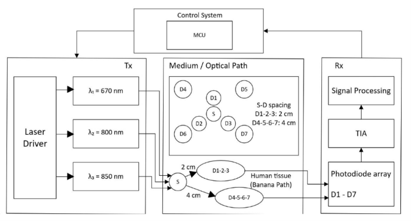
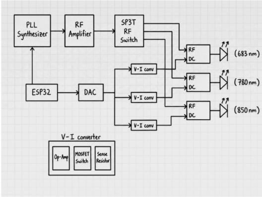
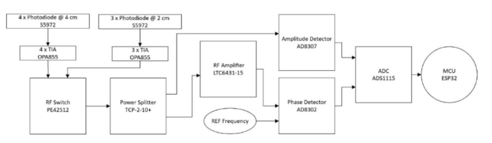

# FD-fNIRS Brain Scanner

> **Portable Frequency-Domain Near Infrared Spectroscopy (FD-fNIRS) System for Rapid Traumatic Brain Injury Detection**
>
> **Drexel University – ENGR 113 Engineering Design Project**

---

## Overview

This project proposes a portable **Frequency-Domain Functional Near Infrared Spectroscopy (FD-fNIRS)** system capable of rapidly screening for traumatic brain injuries (TBI) in athletic and military environments.

Unlike traditional MRI or CT imaging, this design focuses on creating a compact, field-deployable system capable of measuring changes in oxygenated and deoxygenated hemoglobin using multiple near-infrared wavelengths.

The proposed system consists of four major subsystems:

- Multi-wavelength optical transmitter
- Analog optical receiver
- ESP32-based digital controller
- Wireless data transmission to a laptop for processing

---

## Overall System Architecture



The transmitter generates RF-modulated near-infrared light which travels through brain tissue. The receiver detects the attenuated optical signal, extracts amplitude and phase information, and transmits processed measurements wirelessly for further analysis.

---

# My Contributions

This project was completed as a **three-person engineering team**.

My primary responsibilities focused on the **transmitter subsystem** and the overall system architecture.

Specifically, I:

- Designed the complete optical transmitter architecture.
- Developed the initial system-level design used as the foundation of the project.
- Selected RF, optical, and embedded hardware components through datasheet analysis and compatibility evaluation.
- Designed the VCSEL laser bias-current control architecture.
- Calculated laser operating current to ensure safe operation above threshold while remaining below maximum rated current.
- Performed optical efficiency calculations for the transmitter.
- Researched and justified the selection of the three operating wavelengths used for FD-fNIRS measurements (with guidance from the course instructor).
- Created the overall system block diagram.
- Coordinated subsystem integration and technical planning within the engineering team.

---

# System Architecture

## Optical Transmitter



The transmitter subsystem generates RF-modulated optical signals using three VCSEL laser diodes operating at different wavelengths.

Major design features include:

- ESP32 digital controller
- ADF4351 PLL synthesizer
- RF amplifier
- SP3T RF switch
- Programmable DAC-controlled laser bias
- Current-controlled VCSEL drivers
- Bias-tee RF/DC combining network

The transmitter architecture was designed to remain modular, allowing independent testing of each subsystem while minimizing overall system complexity.

---

## Optical Receiver



The receiver subsystem converts weak optical signals into electrical measurements using high-speed photodiodes and analog signal processing.

Key components include:

- Silicon PIN photodiodes
- Transimpedance amplifiers
- RF switching network
- Phase detector
- Amplitude detector
- ADS1115 ADC
- ESP32 wireless controller

---

# Engineering Highlights

- Multi-wavelength optical transmitter
- Frequency-domain NIR spectroscopy
- RF modulation (300–600 MHz)
- VCSEL laser diode control
- Analog receiver design
- Wireless ESP32 communication
- Modular subsystem architecture
- Engineering component selection
- Optical efficiency analysis
- Laser bias-current calculations

---

# Repository Structure

```
fd-fnirs-brain-scanner/
│
├── README.md
├── docs/
│   ├── Design_Report.pdf
│   └── Final_Presentation.pdf
│
├── calculations/
│   └── Engineering_Calculations.xlsx
│
├── diagrams/
│   ├── system_architecture.png
│   ├── transmitter_architecture.png
│   ├── receiver_architecture.png
│   └── wifi_link_budget.png
│
└── images/
```

---

# Documentation

The repository includes:

- Complete engineering design report
- Engineering calculations
- Component selection
- System block diagrams
- Technical presentation
- Supporting design documentation

---

# Future Improvements

Potential future work includes:

- PCB implementation
- Hardware prototype fabrication
- Optical testing
- Signal calibration
- Image reconstruction algorithms
- Clinical validation
- Miniaturized enclosure design

---

# Technologies & Components

### Hardware

- ESP32
- VCSEL Laser Diodes
- ADF4351 PLL Synthesizer
- MCP4728 DAC
- LM324 Operational Amplifier
- SBB5089Z RF Amplifier
- SP3T RF Switch
- ADS1115 ADC
- PIN Photodiodes

### Engineering Topics

- Frequency-Domain fNIRS
- RF Design
- Analog Electronics
- Biomedical Instrumentation
- Embedded Systems
- Optical Systems
- Engineering Design

---

# Team Notice

This repository is intended to showcase my contributions to a collaborative engineering design project completed at Drexel University.

The project was completed by a three-person team. While this repository includes the complete system documentation, the **"My Contributions"** section identifies the areas for which I was primarily responsible.

---

# References

Detailed references and datasheets are available in the complete design report located in the `docs/` directory.
